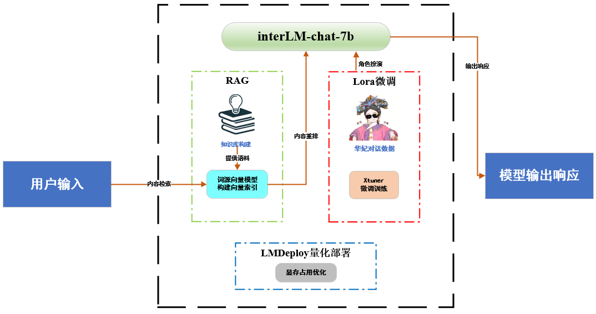
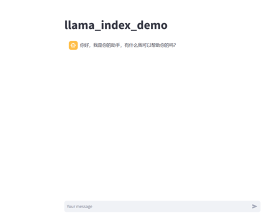

# 寻医生活小助理😊

在日常生活中，我们难免会有一些身体上的不舒服，但是又觉得为这些小问题去医院太费时费力。本项目基于interLM-char-7b模型，旨在打造一款用于身体健康管理和疾病咨询的生活小助手，帮你第一时间分析身体情况和病情症状，并尝试给出一些就诊建议，方便日常生活。
<!-- PROJECT SHIELDS -->

<!-- PROJECT LOGO -->
<br />

<p align="center">
  <a href="https://github.com/createvalues/wp-interLM/">
    
  </a>
  <h3 align="center">"寻医生活小助理😊</h3>
  <p align="center">
    寻医生活小助理😊，加速你的生活！
  </p>

</p>


本项目以interLM-chat-7b为基座模型。结合华妃任务模板数据集+lora微调实现角色扮演。并在兼顾效率和质量的情况下，采用检索增强生成（Retrieval Augmented Generation，RAG）技术更新模型知识库。最后采用LMDeploy框架量化部署，大幅降低模型显存占用。
<br />
<p align="center">
<a href="https://github.com/createvalues/wp-interLM/">
    
</a>
</p>
 
## 目录

- [环境配置](#环境配置)
- [运行演示](#运行演示)
- [部署](#部署)
- [使用到的框架](#使用到的框架)
- [贡献者](#贡献者)
  - [如何参与开源项目](#如何参与开源项目)
- [版本控制](#版本控制)
- [作者](#作者)
- [鸣谢](#鸣谢)

### 环境配置

```
conda create -n llamaindex python=3.10
conda activate llamaindex
conda install pytorch==2.0.1 torchvision==0.15.2 torchaudio==2.0.2 pytorch-cuda=11.7 -c pytorch -c nvidia
# 以下命令安装llama-index依赖包
pip install llama-index==0.10.38 llama-index-llms-huggingface==0.2.0 "transformers[torch]==4.41.1" "huggingface_hub[inference]==0.23.1" huggingface_hub==0.23.1 sentence-transformers==2.7.0 sentencepiece==0.2.0
# 安装streamlit用于网页交互
pip install streamlit==1.36.0
```

### 运行演示

进入rag文件下，运行app.py即可开始对话。
<br />
<p align="center">
<a href="https://github.com/createvalues/wp-interLM/">
    
</a>
</p>

### 使用到的框架

interLM2,XTuner,LlamaIndex,lmdEPLOY

### 贡献者

#### 如何参与开源项目

贡献使开源社区成为一个学习、激励和创造的绝佳场所。你所作的任何贡献都是**非常感谢**的。


1. Fork the Project
2. Create your Feature Branch (`git checkout -b feature/AmazingFeature`)
3. Commit your Changes (`git commit -m 'Add some AmazingFeature'`)
4. Push to the Branch (`git push origin feature/AmazingFeature`)
5. Open a Pull Request

### 版本控制

该项目使用Git进行版本管理。您可以在repository参看当前可用版本。

### 作者

click

邮箱:18220149833@163.com  &ensp; wx:18220149833  

 *您也可以在贡献者名单中参看所有参与该项目的开发者。*

### 版权说明

该项目签署了MIT 授权许可，详情请参阅 [LICENSE.txt](https://github.com/shaojintian/Best_README_template/blob/master/LICENSE.txt)

### 鸣谢


- [interLM](https://github.com/InternLM)
- [书生大模型实战营](https://colearn.intern-ai.org.cn/)


